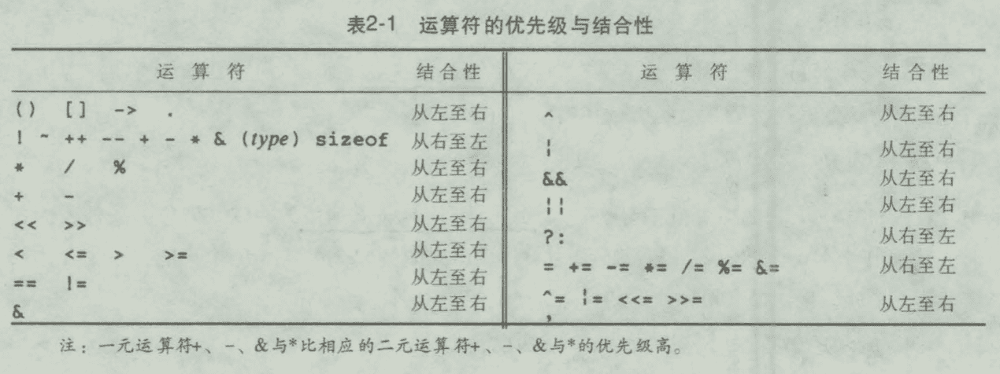

[练习答案参考](https://github.com/fool2fish/the-c-programming-language-exercise-answers)


《C程序设计语言》笔记
----------------

最初 Dennis Ritchie 1973

主流语言 C++与Java都建立在C语言的语法和基本结构的基础上。

1988年，美国国家标准协会 (**ANSI**)为C语言指定了一个精确的标准，即 ANSI C

*《The* C *Programming* Language 》 的第 1版  1978年，第 2版 1988年，中文版2003年


## 引言


实际编写程序才是学习一种新语言的好方法。


## 1 导言

学习一门新程序设计语言的惟一途径就是使用它编写程序 。

### 1.1 入门


一个C语言程序，无论其大小如何，都是由**<font color=#FF8C00>函数</font>**和**<font color=#FF8C00>变量</font>**组成的 。

每个程序都从main函数的起点开始执行。

`#include <stdio.h>`用于告诉编译器在本程序中包含**标准输入/输出库**的信息。

函数之间进行**数据交换**的一种方法是调用函数向被调用函数提供一个值（称为**参数**）列表。

用双引号括起来的字符序列称为**字符串**或字**符串常量**。

在printf 函数的参数中，只能用 `\n`表示换行符，并且printf 函数农远不会自动换行。

类似于`\n`的**转义字符序列**为表示无法输入的字符或不可见

字符提供了一种通用的可扩充的机制 。

```c
\t
\b
\n
```


### 1.2 变量与算法表达式

华氏温度与摄氏温度关系：`C = (5/9)(F-32)`

```c
#include <stdio.h>
/*
	当华氏温度fahr=0, 20, 40, ..., 300时，分别打印花式温度与摄氏温度对照表
*/
int
main()
{
  int fahr, celsius;
  int lower, upper, step;
  
  lower = 0;
  upper = 300;
  step = 20;
  
  fahr = lower;
  while (fahr <= upper) {
    celsius = 5 * (fahr - 32) / 9;
    printf("%d\t%d\n", fahr, celsius);
    fahr = fahr + step;
  }
}
```

程序中允许出现空格、制表符或换行符之处，都可以使用注释。

在C语言中，所有变量都必须先**声明**后使用。声明通常放在函数起始处，在任何可执行语 句之前。声明用于说明变量的属性，它由一个**类型名**和一个**变量表**组成。

正确的缩进以及保留适当空格的程序设计风格对程序的易读性非常

重要 。缩进方式突出了程序的逻辑结构。

建议每行只书写一条语句 ， 并在运算符两边各加上一个空格字符，这样可以使得运算的结合关系更清楚明了 。 

C语言中，整数除法操作将执行舍位，结果中的任何小数部分都会被舍弃，5/9结果为0，因此把除法放到后面。

`printf`是标准函数库中的一个函数，不是C语言本身，C语言本身没有定义输入/输出功能。


### 1.3 for语句

C语言中一个通用规则：**在允许使用某种类型变量值的任何场合，都可以使用该类型的更复杂的表达式** 。

for语句比较适合初始化和增加步长都是单条语句并且逻辑相关的情形，因为它将循环控制语句集中放在一起，且比while语句更紧凑 。


### 1.4 符号常量

程序中使用300 、20等类似的"**幻数**"并不是一个好习惯，它们几乎无法向以后阅读该程序的人提供什么信息，而且使程序的修改变得更加困难。 处理这种幻数的 一种方法是赋予它们有意义的名字 。

```c
#define 名字 替换文本
```

在该定义之后，程序中出现的所有在`#define`中定义的`名字`(既没有用引号引起来，也不是其他名字的一部分)都将用相应的替换文本替换 。

```c
#define LOWER 0
#define UPPER 300
#define STEP 	20
```


### 1.5 字符输入/输出

```c
c = getchar();
putchar(c);
```


#### 文件复制

借助于getchar与putchar函数，可以在不了解其他输入/输出知识的情况下编写出数量惊人的有用的代码 。

复制基本思想：

```c
读一个字符
while(该字符不是文件结束指示符)
  输出刚读入的字符
  读下一个字符
```

```c
#include <stdio.h>

int main()
{
  int c;
  
  c = getchar();
  while (c != EOF) {
    putchar(c);
    c = getchar();
  }
}
```

字符在键盘、屏幕或其他的任何地方无论以什么形式表现，它在机器内部都是以位模式存储的 。

`char`类型专门用于存储这种字符型数据，当然任何整型 (`int`) 也可以用于存储字符型数据 。 

**EOF**（end of file，文件结束）。

在声明变量c的时候，必须让它大到足以存放 getchar函数返回的任何值 。 并且还要能存储文件结束符EOF，EOF一般会是-1，char类型会报错，因此在此使用 `int` 类型 。

赋值操作是 一个表达式，并且具有一个值，即赋值后左边变量保存的值 。也就是说，赋值可以作为更大的表达式的一部分出现。 简化：

```c
#include <stdio.h>

int main()
{
  int c;
  
  while (( c = getchar()) != EOF) 
    putchar(c);
}
```

括号不能省，因为 不等于运算符`!=`的优先级比赋值运算符`=`的优先级要高。

#### 字符计数

```c
#include <stdio.h>

int main()
{
  long nc;
  
  nc = 0;
  while (getchar() != EOF) 
    ++nc;
  printf("%ld\n", nc);
}
```

```c
#include <stdio.h>

int main()
{
  double nc;
  for (nc = 0; getchar() != EOF; ++nc)
    ;
  printf("%.0f\n", nc);
}
```

`getchar()`必需读到一个换行符或者文件结束符EOF才进行一次输出，文件结束符EOF，Windows下为组合键**Ctrl+Z**，Unix/Linux下为组合键**Ctrl+D**。

`%.0f`强制不打印小数点和小 数部分。

#### 行计数

标准库保证输入文本流以行序列的形式出现，每一行均以换行符结束。因此统计行数等价于统计换行符的个数 。

```c
#include <stdio.h>

int main()
{
  int c, nl;
  
  nl = 0;
  while ((c = getchar()) != EOF) {
    if (c == '\n') 
      ++nl;
  }
  printf("%d\n", nl);
}
```

单引号中的字符表示一个整型值，该值等于此字符在机器**字符集**中对应的数值，称之为**<font color=#FF8C00>字符常量</font>** 。 它只不过是小的整型数的另 一种写法而已 。 例如 ， `'A'`是一个字符常量，在 ASCII字符集中其值为 `65` 。

**字符串常量**中使用的转义字符序列也是合法的字符常量，比如 ， `'\n'`代表换行符的值， 在ASCII字符集中其值为 `10`。

```c
/*
练习1-8 编写一个统计结格、制表符与换行符个数的程序 。 
*/
#include <stdio.h>

int main()
{
  long c;
  int ns, nt, nl;
  
  ns = nt = nl = 0;
  while ((c = getchar()) != EOF) {
    if (c == ' ') ++ns;
    else if (c == '\t') ++nt;
    else if (c == '\n') ++nl;
  }
  printf("Space numbers is %d, Tab numbers is %d, Line Break numbers is %d", ns, nt, nl);
}

```

```c
/*
1-9 编写一个将输入复制到输出的程序，并将其中连续的多个空格用一个空格代替。
*/

#include <stdio.h>

int
main()
{
    int c;
    int prev;

    while ((c = getchar()) != EOF) {
        if ( c != ' ' || prev != ' ')
            putchar(prev = c);
    }
}

```


```c
/*
1-10 编写一个将输入复制到输出的程序，并将其中的制表符替换为\t ， 把回退符替换为 \b，把反斜杠替换为\\ 。 这样可以将制表符和回退符以可见的方式显示出来。
*/

#include <stdio.h>

int main()
{
   int c;

   while ((c = getchar()) != EOF) {
        if (c == '\t')
            printf("\\t");
        else if ( c == '\b')
            printf("\\b");
        else if (c == '\\')
            printf("\\\\");
        else
            putchar(c);
   }
}
```

> ??怎么输入回退符

#### 单词计数

```c
#include <stdio.h>

#define IN 1			/* 在单词内 */
#define OUT 0			/* 在单词外 */

/*
	统计行数、单词数与字符数
	这里单词的定义：任何其中不包含空格、制表符或换行符的字符序列。
*/
int main()
{
	int c, nl, nw, nc, state;
  
  state = OUT;
  nl = nw = nc = 0;
  while ((c = getchar()) != EOF) {
    ++nc;
    if (c == '\n') 
      ++nl;
   	if (c == ' ' || c == '\n' || c == '\t')
      state = OUT;
    else if (state == OUT) {
      state = IN;
      ++nw;
    }
  }
  printf("%d %d %d\n", nl, nw, nc);
}
```

程序执行时，每当遇到单词的第一个字符，它就作为一个新单词加以统计。 `state`变量记录程序当前是否正位于 一个单词之中，它的初值是"不在单词中"，即初值被赋为`OUT`。 

```c
nl = (nw = (nc = 0));

nl = nw = nc = 0;
```

**在兼有值与赋值两种功能的表达式中，赋值结合次序是由右至左。**


### 1.6 数组

```c
#include <stdio.h>
/*
	统计各个数字、空白符(包括 空格符、制表 符及换行符)以及所有其他字符出现的次数
*/

int main()
{
  int c, i, nwhite, nother;
  int ndigit[10];
  
  nwhite = nother = 0;
  for (i = 0; i < 10; ++i)
    ndigit[i] = 0;
  
  while ((c = getchar()) != EOF) {
    if (c >= '0' && c <= '9')
      ++ndigit[c - '0'];
    else if (c == ' ' || c == '\n' || c == '\t')
      ++nwhite;
    else
      ++nother;
  }
  
  printf("digits =");
    for (i = 0; i < 10; ++i)
      printf(" %d", ndigit[i]);
  printf(", white space = %d, other = %d\n", nwhite, nother);
}
```


### 1.7 函数

```c
#include <stdio.h>

int power(int m, int n);
          
/* 测试power函数 */ 
int main()
{
	int i;
	for (i = 0; i < 10; ++i)
		printf("%d %d %d\n"，i, power(2, i), power(-3, i));
   return 0;
}
       
/* power 函数:求底数的n次军;其中 n >= 0 */
int power(int base, int n)
{
  int i, p;
  p = 1;
  for (i = 1; i <= n; ++i)
  	p = p * base; 
  return p;
}
```


函数定义的一般形式：

```c
返回值类型 函数名(0个或多个参数声明)
{
	声明部分 
  语句序列 
}

```


函数不一定都有返回值 。不带表达式的 return语句将把控制权返回给调用者，但不返回有用的值 。

main本身也是函数，它的调用者实际上就是程序的执行环境。一般来说，main的返回值为0表示正常终止，返回值为非0表示出现异常情况或出错结束条件 。 main中的return语句可省略。

**函数原型**

```c
int power(int m, int n);
```

函数原型必须与函数的定义和用法一致，但参数名不要求相同。实际上函数原型中参数名可以省略：

```c
int power(int, int);
```

但是，合适的参数名能够起到很好的**说明性**作用。

### 1.8 参数——传值调用

在C语言中，所有函数参数都是"通过值"传递的 。也就是说，传递给被调用函数的参数值存放在临时变量中，而不是存放在原来的变量中 。 被调用函数不能直接修改主调函数中变量的值，而只能修改其私有的临时副本的值。

必要时，也可以让函数能够修改主调函数中的变量。 这种情况下，调用者需要向被调用函数提供待设置值的变量的地址(从技术角度看，地址就是指向变量的指针)，而被调用函数则需要将对应的参数声明为指针类型，并通过它间接访问变量。

 当把数组名用作参数时，传递给函数的值是数组起始元素的位置或地址——它并不复制数组元素本身。 

### 1.9 字符数组


```c
#include <stdio.h>
#define MAXLINE 1000			/* 允许的输入行的最大长度 */

int getline(char line[], int maxline);
void copy(char to[], char from[]);

/*
	打印最长的输入行
*/
int main()
{
  int len;								/* 当前行长度 */
  int max;								/* 目前为止发现的最长行的长度 */
  char line[MAXLINE];			/* 当前的输入行 */
  char longest[MAXLINE];	/* 用于保存最长的行 */
  
  max = 0;
  while ((len = getline(line, MAXLINE)) > 0) {
		if (len > max) {
      max = len;
      copy(longest, line);
    }
  }
  if (max > 0) 
    printf("%s", longest);
  return 0;
}

/* 将一行读入到s中，并返回其长度 */
int getline(char s[], int lim)
{
  int c, i;
  for (i = 0; i < lim - 1 && (c=getchar()) != EOF && c != '\n'; ++i)
    s[i] = c;
  if (c == '\n'){
    s[i] = c;
    ++i;
  }
  s[i] = '\0';
  return i;
}

/* 将from复制到to，假定to足够大 */
void copy(char to[], char from[])
{
  int i;
  i = 0;
  while ((to[i] = from[i]) != '\0')
    ++i;
}
```


### 1.10 外部变量与作用域


如果程序包含在多个源文件中，而某个变量在*file1*文件中定义、在*file2*和*file3*文件中使用，那么在文件*file2*与*file3*中就需要使用`extern`声明来建立该变量与其定义之间的联系 。 

人们通常把变量和函数的`extern`声明放在一个单独的文件中(习惯上称之为**头文件**)，并在每个源文件的开头使用`#include`语句把所要用的头文件包含进来 。 后缀名`. h`约定为头文件名的扩展名 。


## 2 类型、运算符与表达式

**变量和常量**是程序处理的两种**基本数据对象**。 

**声明语句**说明变量的**名字及类型**，也可以指定变量的**初值** 。 

**运算符**指定将要进行的**操作**。 

**表达式**则把变量与常量组合起来生成新的值。 

对象的类型决定该对象可取值的集合以及可以对该对象执行的操作。 

### 2.1 变量名


内部名（internal name）是仅在定义该标识符的文件内使用的标识符，长度最长为31个字符。

外部名（external name）是链接中涉及的在文件间调用的函数名等，长度最长为6个字符。


### 2.2 数据类型及长度

| 基本数据类型 |              | 说明                                         |
| ------------ | ------------ | -------------------------------------------- |
| `char`       | 字符型       | 占用一个字节，可以存放本地字符集中的一个字符 |
| `int`        | 整型         | 通常反映了所用机器中整数的最自然长度         |
| `float`      | 单精度浮点型 |                                              |
| `double`     | 双精度浮点型 |                                              |

限定符`short`和`long`用于限定整型：

```c
short int sh;
long int counter;
```

此时关键字`int`可以省略：

```c
short sh;
long counter;
```

类型限定符 `signed`与`unsigned`可用于限定char类型或任何整型 。


🔖

### 2.3 常量

`long`类型的常量以字母 `l`或 `L`结尾，如 `123456789L`。 

无符号常量以字母`U`或`U`结尾 。 后缀`ul`或`UL`表明是`unsigned long`类型。

浮点数常量中包含一个小数点(如`123.4`)或一个指数(如`1e-2` )，也可以两者都有 。 没有后缀的浮点数常量为`double`类型 。 后缀 `f`或`F`表示`float`类型，而后缀`l`或`L`则表示 `long double`类型 。

带前缀`0`的整型常量表示它为八进制形式；前缀为`0x`或`0X` ，则表示它为十六进制形式 。 八进制与十六进制的常量也可以使用后缀`L`表示`long`类型，使用后缀`U`表示`unsigned`类型。

一个**字符常量**是一个整数，书写时将一个字符括在单引号号，如`'x'` 。字符在机器字符集中的数值就是字符常量的值。

某些字符可以通过转义字符序列(例如，换行符\口)表示为字符和字符串常量 。 转义字 符序列看起来像两个字符，但只表水 4个字符 。 

常量表达式是仅仅只包含常量的表达式。这种表达式在编译时求值，而不在运行时求值 。它可以出现在常量可以出现的任何位置，例如：

```c
#define MAXLINE 1000 
char line[MAXLINE+11];
```


**字符串常量**也叫**字符串字面值**，是用双引号括起来的0个或多个字符组成的字符序列 。双引号不是字符串的一部分，它只用于限定字符串 。 

从技术角度看，字符串常量就是字符数组 。字符串的内部表示使用一个空字符 '\0`作为串的结尾。


 **枚举**是一个常量整型值的列表。

```c
enum boolean { NO, YES };
```

在没有显式说明的情况下， `enum`类型中第一个枚举名的值为 `0`，第二个为`1` ，依此类推 。如果只指定了部分枚举名的值，那么未指定值的枚举名的值将依着最后一个指定值向后递增：

```c
enum escapes { BELL = '\a', BACKSPACE = '\b', TAB = '\t', NEWLINE = '\n', VTAB = '\v', RETURN = '\r'};

enum months { JAN = 1, FEB, MAR, APR, MAY, JUN, JUL, AUG, SEP, OCT, NOV, DEC };		/* FEB的值为2， MAR的值为3，依此类推 */
```

同一枚举中不同的名字可以具有相同的值 。

枚举为建立常量值与名字之间的关联提供了一种便利的方式 。 相对于`#define`语句来说，它的优势在于常量值可以自动生成 。 

尽管可以声明`enum`类型的变量，但编译器不检查这种类型的变量中存储的值是杏为该枚举的有效值 。不过，枚举变量提供这种检查，因此枚举比`#define`更具优势 。此外，调试程序可以以符号形式打印出枚举变量的值。

### 2.4 声明

所有变量都必须先声明后使用。

声明的同时也可以对变量进行初始化，变量名的后面紧跟一个等号以及一个表达式，该表达式就充当对变量进行初始化的**初始化表达式** 。 例如:

```c
char esc = '\\';
int i=0;
int limit = MAXLINE + 1; 
float eps = 1.0e-5;
```

初始化表达式必须为常量表达式。


任何变量的声明都可以使用`const`限定符限定，指定变量的值不能被修改。 对数组而言，`const`限定符指定数组所有元素的值都不能被修改:

```c
const double e = 2.71828182845905; 
const char msq[] = "warning: ";
```

`const`限定符也可配合数组参数使用，它表明函数不能修改数组元素的值:

```c
int strlen(const char[]);
```


### 2.5 算术运算符

二元算术运算符：

```c
+
-
*
/
%
```

取模运算符`%`不能应用于`float`号或`double`类型 。 在有负操作数的情况下，整数除法截取的方向以及取模运算结果的符号取决于具体机器的实现，这和处理上溢或下溢的情况是一样的 。

一元运算符：

```c
+
-
```


### 2.6 关系运算符与逻辑运算符

关系运算符：

```c
> >= < <=
== !=			/* 优先级更高 */
```

关系运算符的优先级比算术运算符低 。

逻辑运算符：

```c
&&	||
```

按从左到右的顺序进行求值，并且，在知道结果值为真或假后立即停止计算 。 

`&&`的优先级高于`||`，但都低于关系运算符。

逻辑非运算符`!`。

🔖

### 2.7 类型转换

一般来说，自动转换是指把"比较窄的"操作数转换为"比较宽的"操作数，并且不 丢失信息的转换。

🔖

### 2.8 自增运算符与自减运算符

```c
++
--
```

🔖


### 2.9 按位运算符

```c
&
|
^  
<<  
>>  
~   
```


### 2.10 赋值运算符与表达式


### 2.11 条件表达式


### 2.12 运算符优先级与求值次序




## 3 控制流

### 语句与程序块

表达式后加上一个分号`;`就是变成了**<font color=#FF8C00>语句</font>**。

用一对花括号 `{`与`}` 把一 组声明和语句括在一起就构成了一个**复合语句（**也叫作**程序块**），复合语句在语法上等价于单条语句。 


## 4 函数与程序结构


### 4.1 函数的基本知识


### 4.2 返回非整型值的函数


### 4.3 外部变量


### 4.4 作用域规则


### 4.5 头文件


### 4.6 静态变量


### 4.7 寄存器变量


### 4.8 程序块结构


### 4.9 初始化


### 4.10 递归


### 4.11 C预处理器


## 5 指针与数组


### 5.1 指针与地址


### 5.2 指针与函数参数


### 5.3 指针与数组


### 5.4 地址算术运算


### 5.5 字符指针与函数


### 5.6 指针数组以及指向指针的指针


### 5.7 多维数组


### 5.8 指针数组的初始化


### 5.9 指针与多维数组


### 5.10 命令行参数


### 5.11 指向函数的指针


### 5.12 复杂声明


## 6 结构

### 6.1 结构的基本知识


### 6.2 结构与函数


### 6.3 结构数组


### 6.4 指向街构的指针


### 6.5 自引用结构


### 6.6 表查找


### 6.7 类型定义( typedef )


### 6.8 Unions 


### 6.9 Bit-fields


## 7 输入与输出


### 7.1 标准输入/输出


### 7.2 格式化输出——printf函数


### 7.3 变长参数表


### 7.4 格式化输入——scanf函数


### 7.5 文件访问


### 7.6 错误处理一--stderr和 exit


### 7.7 行输入和行输出


### 7.8 其他函数


#### 字符串操作函数


#### 字符类别测试和转换函数


#### ungetc函数


#### 命令执行函数


#### 存储管理函数


#### 数学函数


#### 随机数发生器函数


## 8 UNIX系统接口

### 8.1 文件描述符


### 8.2 低级 I/O一read和write


### 8.3 open、 creat、 close和 unlink


### 8.4 随机访问——seek


### 8.5 实例——fopen和 getc函数的实现


### 8.6 实例——目录列表


### 8.7 实例一一存储分配程序


## 附录A 参考手册

### 词法规则

#### 记号


#### 注释


#### 标识符


#### 关键字

```c
auto 			double 		int 					struct 
break 		else 			long 					switch 
case 			enum 			register 			typedef 
char 			extern 		return 				un10n 
const 		float 		short 				unsigned 
continue	for	 			signed 				void 
default 	goto 			sizeof 				volatile 
do 				if 				static 				while
```

#### 常量

整型常量 

字符常量 

浮点常量

枚举常量


#### 字符串字面值


### 语法符号


### 标识符的含义


### 对象和左值


### 转换


### 表达式


### 声明


### 语旬


### 外部声明


### 作用域与连接


### 预处理


### 语法


## 附录B 标准库


### 附录 ASCII码表

| Bin(二进制) | Oct(八进制) | Dec(十进制) | Hex(十六进制) | 缩写/字符                   | 解释         |
| ----------- | ----------- | ----------- | ------------- | --------------------------- | ------------ |
| 0000 0000   | 00          | 0           | 0x00          | NUL(null)                   | 空字符       |
| 0000 0001   | 01          | 1           | 0x01          | SOH(start of headline)      | 标题开始     |
| 0000 0010   | 02          | 2           | 0x02          | STX (start of text)         | 正文开始     |
| 0000 0011   | 03          | 3           | 0x03          | ETX (end of text)           | 正文结束     |
| 0000 0100   | 04          | 4           | 0x04          | EOT (end of transmission)   | 传输结束     |
| 0000 0101   | 05          | 5           | 0x05          | ENQ (enquiry)               | 请求         |
| 0000 0110   | 06          | 6           | 0x06          | ACK (acknowledge)           | 收到通知     |
| 0000 0111   | 07          | 7           | 0x07          | BEL (bell)                  | 响铃         |
| 0000 1000   | 010         | 8           | 0x08          | BS (backspace)              | 退格         |
| 0000 1001   | 011         | 9           | 0x09          | HT (horizontal tab)         | 水平制表符   |
| 0000 1010   | 012         | 10          | 0x0A          | LF (NL line feed, new line) | 换行键       |
| 0000 1011   | 013         | 11          | 0x0B          | VT (vertical tab)           | 垂直制表符   |
| 0000 1100   | 014         | 12          | 0x0C          | FF (NP form feed, new page) | 换页键       |
| 0000 1101   | 015         | 13          | 0x0D          | CR (carriage return)        | 回车键       |
| 0000 1110   | 016         | 14          | 0x0E          | SO (shift out)              | 不用切换     |
| 0000 1111   | 017         | 15          | 0x0F          | SI (shift in)               | 启用切换     |
| 0001 0000   | 020         | 16          | 0x10          | DLE (data link escape)      | 数据链路转义 |
| 0001 0001   | 021         | 17          | 0x11          | DC1 (device control 1)      | 设备控制1    |
| 0001 0010   | 022         | 18          | 0x12          | DC2 (device control 2)      | 设备控制2    |
| 0001 0011   | 023         | 19          | 0x13          | DC3 (device control 3)      | 设备控制3    |
| 0001 0100   | 024         | 20          | 0x14          | DC4 (device control 4)      | 设备控制4    |
| 0001 0101   | 025         | 21          | 0x15          | NAK (negative acknowledge)  | 拒绝接收     |
| 0001 0110   | 026         | 22          | 0x16          | SYN (synchronous idle)      | 同步空闲     |
| 0001 0111   | 027         | 23          | 0x17          | ETB (end of trans. block)   | 结束传输块   |
| 0001 1000   | 030         | 24          | 0x18          | CAN (cancel)                | 取消         |
| 0001 1001   | 031         | 25          | 0x19          | EM (end of medium)          | 媒介结束     |
| 0001 1010   | 032         | 26          | 0x1A          | SUB (substitute)            | 代替         |
| 0001 1011   | 033         | 27          | 0x1B          | ESC (escape)                | 换码(溢出)   |
| 0001 1100   | 034         | 28          | 0x1C          | FS (file separator)         | 文件分隔符   |
| 0001 1101   | 035         | 29          | 0x1D          | GS (group separator)        | 分组符       |
| 0001 1110   | 036         | 30          | 0x1E          | RS (record separator)       | 记录分隔符   |
| 0001 1111   | 037         | 31          | 0x1F          | US (unit separator)         | 单元分隔符   |
| 0010 0000   | 040         | 32          | 0x20          | (space)                     | 空格         |
| 0010 0001   | 041         | 33          | 0x21          | !                           | 叹号         |
| 0010 0010   | 042         | 34          | 0x22          | "                           | 双引号       |
| 0010 0011   | 043         | 35          | 0x23          | #                           | 井号         |
| 0010 0100   | 044         | 36          | 0x24          | $                           | 美元符       |
| 0010 0101   | 045         | 37          | 0x25          | %                           | 百分号       |
| 0010 0110   | 046         | 38          | 0x26          | &                           | 和号         |
| 0010 0111   | 047         | 39          | 0x27          | '                           | 闭单引号     |
| 0010 1000   | 050         | 40          | 0x28          | (                           | 开括号       |
| 0010 1001   | 051         | 41          | 0x29          | )                           | 闭括号       |
| 0010 1010   | 052         | 42          | 0x2A          | *                           | 星号         |
| 0010 1011   | 053         | 43          | 0x2B          | +                           | 加号         |
| 0010 1100   | 054         | 44          | 0x2C          | ,                           | 逗号         |
| 0010 1101   | 055         | 45          | 0x2D          | -                           | 减号/破折号  |
| 0010 1110   | 056         | 46          | 0x2E          | .                           | 句号         |
| 0010 1111   | 057         | 47          | 0x2F          | /                           | 斜杠         |
| 0011 0000   | 060         | 48          | 0x30          | 0                           | 字符0        |
| 0011 0001   | 061         | 49          | 0x31          | 1                           | 字符1        |
| 0011 0010   | 062         | 50          | 0x32          | 2                           | 字符2        |
| 0011 0011   | 063         | 51          | 0x33          | 3                           | 字符3        |
| 0011 0100   | 064         | 52          | 0x34          | 4                           | 字符4        |
| 0011 0101   | 065         | 53          | 0x35          | 5                           | 字符5        |
| 0011 0110   | 066         | 54          | 0x36          | 6                           | 字符6        |
| 0011 0111   | 067         | 55          | 0x37          | 7                           | 字符7        |
| 0011 1000   | 070         | 56          | 0x38          | 8                           | 字符8        |
| 0011 1001   | 071         | 57          | 0x39          | 9                           | 字符9        |
| 0011 1010   | 072         | 58          | 0x3A          | :                           | 冒号         |
| 0011 1011   | 073         | 59          | 0x3B          | ;                           | 分号         |
| 0011 1100   | 074         | 60          | 0x3C          | <                           | 小于         |
| 0011 1101   | 075         | 61          | 0x3D          | =                           | 等号         |
| 0011 1110   | 076         | 62          | 0x3E          | >                           | 大于         |
| 0011 1111   | 077         | 63          | 0x3F          | ?                           | 问号         |
| 0100 0000   | 0100        | 64          | 0x40          | @                           | 电子邮件符号 |
| 0100 0001   | 0101        | 65          | 0x41          | A                           | 大写字母A    |
| 0100 0010   | 0102        | 66          | 0x42          | B                           | 大写字母B    |
| 0100 0011   | 0103        | 67          | 0x43          | C                           | 大写字母C    |
| 0100 0100   | 0104        | 68          | 0x44          | D                           | 大写字母D    |
| 0100 0101   | 0105        | 69          | 0x45          | E                           | 大写字母E    |
| 0100 0110   | 0106        | 70          | 0x46          | F                           | 大写字母F    |
| 0100 0111   | 0107        | 71          | 0x47          | G                           | 大写字母G    |
| 0100 1000   | 0110        | 72          | 0x48          | H                           | 大写字母H    |
| 0100 1001   | 0111        | 73          | 0x49          | I                           | 大写字母I    |
| 01001010    | 0112        | 74          | 0x4A          | J                           | 大写字母J    |
| 0100 1011   | 0113        | 75          | 0x4B          | K                           | 大写字母K    |
| 0100 1100   | 0114        | 76          | 0x4C          | L                           | 大写字母L    |
| 0100 1101   | 0115        | 77          | 0x4D          | M                           | 大写字母M    |
| 0100 1110   | 0116        | 78          | 0x4E          | N                           | 大写字母N    |
| 0100 1111   | 0117        | 79          | 0x4F          | O                           | 大写字母O    |
| 0101 0000   | 0120        | 80          | 0x50          | P                           | 大写字母P    |
| 0101 0001   | 0121        | 81          | 0x51          | Q                           | 大写字母Q    |
| 0101 0010   | 0122        | 82          | 0x52          | R                           | 大写字母R    |
| 0101 0011   | 0123        | 83          | 0x53          | S                           | 大写字母S    |
| 0101 0100   | 0124        | 84          | 0x54          | T                           | 大写字母T    |
| 0101 0101   | 0125        | 85          | 0x55          | U                           | 大写字母U    |
| 0101 0110   | 0126        | 86          | 0x56          | V                           | 大写字母V    |
| 0101 0111   | 0127        | 87          | 0x57          | W                           | 大写字母W    |
| 0101 1000   | 0130        | 88          | 0x58          | X                           | 大写字母X    |
| 0101 1001   | 0131        | 89          | 0x59          | Y                           | 大写字母Y    |
| 0101 1010   | 0132        | 90          | 0x5A          | Z                           | 大写字母Z    |
| 0101 1011   | 0133        | 91          | 0x5B          | [                           | 开方括号     |
| 0101 1100   | 0134        | 92          | 0x5C          | \                           | 反斜杠       |
| 0101 1101   | 0135        | 93          | 0x5D          | ]                           | 闭方括号     |
| 0101 1110   | 0136        | 94          | 0x5E          | ^                           | 脱字符       |
| 0101 1111   | 0137        | 95          | 0x5F          | _                           | 下划线       |
| 0110 0000   | 0140        | 96          | 0x60          | `                           | 开单引号     |
| 0110 0001   | 0141        | 97          | 0x61          | a                           | 小写字母a    |
| 0110 0010   | 0142        | 98          | 0x62          | b                           | 小写字母b    |
| 0110 0011   | 0143        | 99          | 0x63          | c                           | 小写字母c    |
| 0110 0100   | 0144        | 100         | 0x64          | d                           | 小写字母d    |
| 0110 0101   | 0145        | 101         | 0x65          | e                           | 小写字母e    |
| 0110 0110   | 0146        | 102         | 0x66          | f                           | 小写字母f    |
| 0110 0111   | 0147        | 103         | 0x67          | g                           | 小写字母g    |
| 0110 1000   | 0150        | 104         | 0x68          | h                           | 小写字母h    |
| 0110 1001   | 0151        | 105         | 0x69          | i                           | 小写字母i    |
| 0110 1010   | 0152        | 106         | 0x6A          | j                           | 小写字母j    |
| 0110 1011   | 0153        | 107         | 0x6B          | k                           | 小写字母k    |
| 0110 1100   | 0154        | 108         | 0x6C          | l                           | 小写字母l    |
| 0110 1101   | 0155        | 109         | 0x6D          | m                           | 小写字母m    |
| 0110 1110   | 0156        | 110         | 0x6E          | n                           | 小写字母n    |
| 0110 1111   | 0157        | 111         | 0x6F          | o                           | 小写字母o    |
| 0111 0000   | 0160        | 112         | 0x70          | p                           | 小写字母p    |
| 0111 0001   | 0161        | 113         | 0x71          | q                           | 小写字母q    |
| 0111 0010   | 0162        | 114         | 0x72          | r                           | 小写字母r    |
| 0111 0011   | 0163        | 115         | 0x73          | s                           | 小写字母s    |
| 0111 0100   | 0164        | 116         | 0x74          | t                           | 小写字母t    |
| 0111 0101   | 0165        | 117         | 0x75          | u                           | 小写字母u    |
| 0111 0110   | 0166        | 118         | 0x76          | v                           | 小写字母v    |
| 0111 0111   | 0167        | 119         | 0x77          | w                           | 小写字母w    |
| 0111 1000   | 0170        | 120         | 0x78          | x                           | 小写字母x    |
| 0111 1001   | 0171        | 121         | 0x79          | y                           | 小写字母y    |
| 0111 1010   | 0172        | 122         | 0x7A          | z                           | 小写字母z    |
| 0111 1011   | 0173        | 123         | 0x7B          | {                           | 开花括号     |
| 0111 1100   | 0174        | 124         | 0x7C          | \|                          | 垂线         |
| 0111 1101   | 0175        | 125         | 0x7D          | }                           | 闭花括号     |
| 0111 1110   | 0176        | 126         | 0x7E          | ~                           | 波浪号       |
| 0111 1111   | 0177        | 127         | 0x7F          | DEL (delete)                | 删除         |


