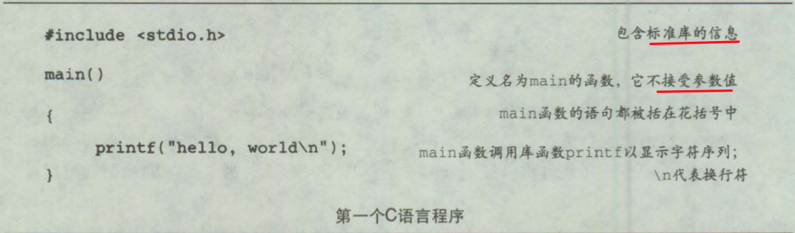

《C程序设计语言》笔记
----------------

最初 Dennis Ritchie 1973

主流语言 C++与Java都建立在C语言的语法和基本结构的基础上。

1988年，美国国家标准协会 (**ANSI**)为C语言指定了一个精确的标准，即 ANSI C

*《The* C *Programming* Language 》 的第 1版  1978年，第 2版 1988年，中文版2003年


## 引言


实际编写程序才是学习一种新语言的好方法。


## 1 导言

学习一门新程序设计语言的惟一途径就是使用它编写程序 。

### 1.1 入门



一个C语言程序，无论其大小如何，都是由**<font color=#FF8C00>函数</font>**和**<font color=#FF8C00>变量</font>**组成的 。

每个程序都从main函数的起点开始执行。

`#include <stdio.h>`用于告诉编译器在本程序中包含**标准输入/输出库**的信息。

函数之间进行**数据交换**的一种方法是调用函数向被调用函数提供一个值（称为**参数**）列表。

用双引号括起来的字符序列称为**字符串**或字**符串常量**。

在printf 函数的参数中，只能用 `\n`表示换行符，并且printf 函数农远不会自动换行。

类似于`\n`的**转义字符序列**为表示无法输入的字符或不可见

字符提供了一种通用的可扩充的机制 。

### 1.2 变量与算法表达式

华氏温度与摄氏温度关系：`C = (5/9)(F-32)`

```c
#include <stdio.h>
/*
	当华氏温度fahr=0, 20, 40, ..., 300时，分别打印花式温度与摄氏温度对照表
*/
int
main()
{
  int fahr, celsius;
  int lower, upper, step;
  
  lower = 0;
  upper = 300;
  step = 20;
  
  fahr = lower;
  while (fahr <= upper) {
    celsius = 5 * (fahr - 32) / 9;
    printf("%d\t%d\n", fahr, celsius);
    fahr = fahr + step;
  }
}
```

程序中允许出现空格、制表符或换行符之处，都可以使用注释。

在C语言中，所有变量都必须先**声明**后使用。声明通常放在函数起始处，在任何可执行语 句之前。声明用于说明变量的属性，它由一个**类型名**和一个**变量表**组成。

正确的缩进以及保留适当空格的程序设计风格对程序的易读性非常

重要 。缩进方式突出了程序的逻辑结构。

建议每行只书写一条语句 ， 并在运算符两边各加上一个空格字符，这样可以使得运算的结合关系更清楚明了 。 

C语言中，整数除法操作将执行舍位，结果中的任何小数部分都会被舍弃，5/9结果为0，因此把除法放到后面。

`printf`是标准函数库中的一个函数，不是C语言本身，C语言本身没有定义输入/输出功能。


### 1.3 for语句

C语言中一个通用规则：**在允许使用某种类型变量值的任何场合，都可以使用该类型的更复杂的表达式** 。

for语句比较适合初始化和增加步长都是单条语句并且逻辑相关的情形，因为它将循环控制语句集中放在一起，且比while语句更紧凑 。


### 1.4 符号常量

程序中使用300 、20等类似的"**幻数**"并不是一个好习惯，它们几乎无法向以后阅读该程序的人提供什么信息，而且使程序的修改变得更加困难。 处理这种幻数的 一种方法是赋予它们有意义的名字 。

```c
#define 名字 替换文本
```

在该定义之后，程序中出现的所有在`#define`中定义的`名字`(既没有用引号引起来，也不是其他名字的一部分)都将用相应的替换文本替换 。

```c
#define LOWER 0
#define UPPER 300
#define STEP 	20
```


### 1.5 字符输入/输出


#### 文件复制


#### 字符计数


#### 行计数


#### 单词计数


### 1.6 数组


### 1.7 函数


### 1.8 参数——传值调用


### 1.9 字符数组


## 2 类型、运算符与表达式


### 2.1 变量名


### 2.2 数据类型及长度


### 2.3 常量


### 2.4 声明


### 2.5 算术运算符


### 2.6 关系运算符与逻辑运算符


### 2.7 类型转换


### 2.8 自增运算符与自减运算符


### 2.9 按位运算符


### 2.10 赋值运算符与表达式


### 2.11 条件表达式


### 2.12 运算符优先级与求值次序


## 3 控制流


## 4 函数与程序结构


### 4.1 函数的基本知识


### 4.2 返回非整型值的函数


### 4.3 外部变量


### 4.4 作用域规则


### 4.5 头文件


### 4.6 静态变量


### 4.7 寄存器变量


### 4.8 程序块结构


### 4.9 初始化


### 4.10 递归


### 4.11 C预处理器


## 5 指针与数组


### 5.1 指针与地址


### 5.2 指针与函数参数


### 5.3 指针与数组


### 5.4 地址算术运算


### 5.5 字符指针与函数


### 5.6 指针数组以及指向指针的指针


### 5.7 多维数组


### 5.8 指针数组的初始化


### 5.9 指针与多维数组


### 5.10 命令行参数


### 5.11 指向函数的指针


### 5.12 复杂声明


## 6 结构

### 6.1 结构的基本知识


### 6.2 结构与函数


### 6.3 结构数组


### 6.4 指向街构的指针


### 6.5 自引用结构


### 6.6 表查找


### 6.7 类型定义( typedef )


### 6.8 Unions 


### 6.9 Bit-fields


## 7 输入与输出


### 7.1 标准输入/输出


### 7.2 格式化输出——printf函数


### 7.3 变长参数表


### 7.4 格式化输入——scanf函数


### 7.5 文件访问


### 7.6 错误处理一--stderr和 exit


### 7.7 行输入和行输出


### 7.8 其他函数


#### 字符串操作函数


#### 字符类别测试和转换函数


#### ungetc函数


#### 命令执行函数


#### 存储管理函数


#### 数学函数


#### 随机数发生器函数


## 8 UNIX系统接口

### 8.1 文件描述符


### 8.2 低级 I/O一read和write


### 8.3 open、 creat、 close和 unlink


### 8.4 随机访问——seek


### 8.5 实例——fopen和 getc函数的实现


### 8.6 实例——目录列表


### 8.7 实例一一存储分配程序


## 附录A 参考手册

### 词法规则

#### 记号


#### 注释


#### 标识符


#### 关键字

```c
auto 			double 		int 					struct 
break 		else 			long 					switch 
case 			enum 			register 			typedef 
char 			extern 		return 				un10n 
const 		float 		short 				unsigned 
continue	for	 			signed 				void 
default 	goto 			sizeof 				volatile 
do 				if 				static 				while
```

#### 常量

整型常量 

字符常量 

浮点常量

枚举常量


#### 字符串字面值


### 语法符号


### 标识符的含义


### 对象和左值


### 转换


### 表达式


### 声明


### 语旬


### 外部声明


### 作用域与连接


### 预处理


### 语法


## 附录B 标准库


