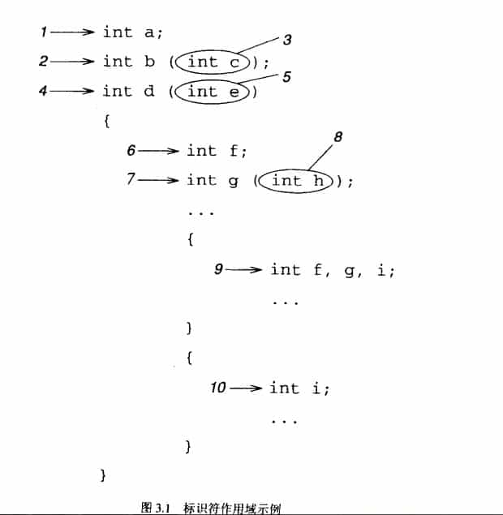
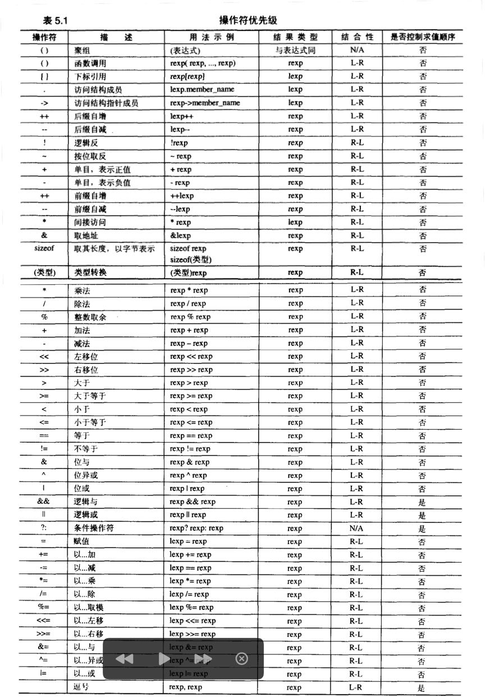
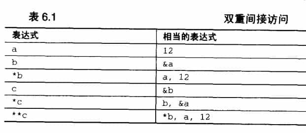
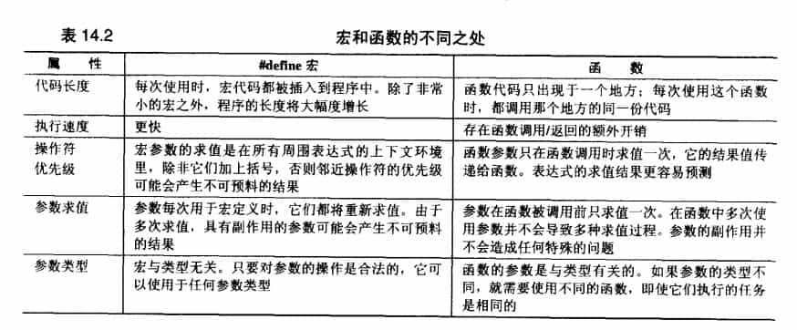

《C与指针》笔记
------------


## 3 数据

### 3.1 基本数据类型

#### 整型字符

短整型，整型，长整型	`singed`, `unsigned`  

**字面值（literal）** **命名常量**（const） **枚举（enumerated）**

limits.h 

#### 浮点类型  

float.h

#### 指针 

指针常量（pointer constant） 

字符串常量（string literal）

#### 聚合类型（数组，结构等）


### 3.2 基本声明

1. 变量声明基本形式： *说明符（一个或多个）  声明表达式列表*
2. 初始化		`int j=11;`
3. 声明简单数组	`int values[10];`
4. 声明指针	`int *b, *c, *d;`
5. 隐式声明	类型名省略默认为整型

### 3.3 typedef	

为各种数据类型定义新名字

` typedef char *ptr_to_char;  
ptr_to_char	a;`  
`#define`不能正确处理指针类型：`#define d_ptr_to_char char *`  
`d_ptr_to_char a, b;`

### 3.4 常量

- `int const a;` 等价 1 `const int a;`
- `int const a = 15;`
- `int *pi;`
- `int const *pci;` 一个指向整型常量的指针（可以修改指针的值，不能修改其所指向的值）
- `int * const cpi;` 一个指向整型的常量指针（指针值无法修改，其所指向的整型值可以修改）
- `int const * const cpci;`
- 也可用#define 定义名字常量：`#define MAX_ELEMENTS 50` 。
- `#define` 定义的名字常量在使用字面值常量的地方都可以使用；const变量只能用于使用变量的地方。


### 3.5 作用域（scope） 



- 代码块作用域 花括号（6,7,9,10） 和  形参（5）
	+ 在任何时刻，两个非嵌套的代码块最多只有一个处于活动状态
- 文件作用域  代码块之外声明的标识符 和 函数名
	+ `#include`指令就好像把一个文件直接写在另一个文件中一样
- 原型作用域
- 函数作用域  只适用于语句标签（goto语句）
	+ 一个函数中的所有语句标签必须唯一

### 3.6 链接属性（linkage）  

- 标识符的**链接属性**决定如何处理在不同文件中出现的标识符
- 3种链接属性：
    + **none** ： 多个声明被当作独立不同的实体。
    + **inernal** ： 在同一源文件内的所有声明是同一实体，不同源文件是不同实体
    + **external** ： 不论声明多少次，位于几个源文件都表示同一个实体。  


- 默认，在3.2图中b，c，f的链接属性为external，其余是none。在这个源文件中调用函数f，实际上将链接到其他源文件所定义的函数，甚至这个函数的定义可能出现在某个函数库。
- `extern`和`static`用于在声明中修改标识符的链接属性。    
   + `static`只对默认链接属性为`external`的声明才有改变链接属性的效果。  

### 3.7 **存储类型（storage class）** 
存储变量值的内存类型

- 变量存储类型决定变量*何时创建*，*何时销毁*，*值保存时间*
- 变量的默认存储类型取决于它的声明位置
  + 任何代码块之外，*静态内存*（不属于堆栈），*静态变量*
  + 在代码块内部声明，*堆栈*，*自动变量*
  + `static` 自动变量转变为静态变量
  + 修改变量的存储类型并不表示修改该变量的作用域
  + `register` **寄存器变量** 编译器决定
- 初始化
  + 静态变量初始化，初始值的位置确定，不需要额外的时间和指令，如果不是显式地指定其初始值，静态变量将初始化为0.
  + 自动变量初始化的4中后果：
     * 除了const变量，声明和赋值是否同时只是风格之差，并无效率之别。
     * 每次都重新初始化。
     * 初始化在运行时执行，可用表达式作为初始化值。
     * 不是显式初始化时，值总是垃圾

### 3.8 static关键字

- 函数定义和代码块之外时，修改标识符的链接属性（external->inernal），但标识符的存储类型和作用域不受影响
- 代码块内部时，自动变量修改为静态变量，但变量的链接属性和作用域不受影响。

### 3.9 总结

- 如果一个变量声明于代码块内部，在它前面添加extern关键字将使它所引用的是全局变量。


### 习题

  - extern可置于变量或者函数前，以表示变量或者函数的定义在别的文件中，提示编译器遇到此变量和函数时在其他模块中寻找其定义。另外，extern也可用来进行链接指定。
  - 13.22 Inside: the variable is automatic, it is reinitialized each time the function is called, its scope is limited to the function, it has no linkage. Outside: the variable is static, it is initialized only once before the program begins to run, it has file scope, and external linkage.
  - 文件作用域是有顺序的，就是变量使用必须在声明赋值之后。


## 4 语句

1. 空语句
2. 表达式语句  表达式 + ;
3. 代码块 {}
4. if语句
5. while语句  break continue
6. for语句
7. do语句	至少执行一次
8. switch语句 
   - `case constant-expression:` **常量表达式（constant-expression）**
   - switch语句中遇到break，执行流就会立即跳到语句列表的末尾。
   - 没有break，执行流会从配比的case开始向下执行
   - default字句
9. goto语句
10. 总结
   - C并不具备任何输入/输出语句;I/O是通过调用库函数实现的。C也不具备任何异常处理语句，它们也是通过调用库函数来完成的。


## 5 操作符和表达式

### 5.1 操作符

#### 算术操作符  

+ - * / %

#### 移位操作符 

+ `<<`  右侧补0
+ `>>`  左侧补 逻辑移位是0，算术移位（符号位是1就补1，符号位为0就补0）
+ **注意**：无符号值执行的所有移位操作都是逻辑移位，但对于有符号值，到底是采用逻辑移位还是算术移位取决于编译器。

#### 位操作符  

& |  ^ 

#### 赋值 = 		

+= -= *= /= %= <<= ..= &= ^= !=

#### 单目操作符  

+ !
+ ~ 对整型类型数求补（1变0,0变1）
+ -
+ + 啥也没干
+ & 取操作数的地址
+ * 与&相反作用
+ sizeof 判断操作数的类型长度 
   * `sizeof (int)`
   * `sizeof(x)`
   * `sizeof(a=b+1)`  判断表达式的长度不需要对表达式求值，a没有被赋值
+ （类型）  强制类型转换(只改变表达式的第一项)  `(float)a` 
+ `++` `--` 
   * `++a = 10;` 错误案例，`++a`只是a值的拷贝，并不是变量本身，不能向其赋值。

#### 关系操作符  

> >= < <= != ==

#### 逻辑操作符  

&&  || 

+ **短路求值（short-circuited evaluation）**
+ 逻辑操作符用于测试零值和非零值，而位操作符用于操作数中对应的位。

#### 条件操作符  

？ ：

#### 逗号操作符	

整个逗号表达式的值就是最后那个表达式的值

#### 下标引用，函数调用和结构成员


### 5.2 布尔值

零为假，任何非零值皆为真。

### 5.3 左值和右值

左值标识了一个可以存储值的位置，**特定位置**

右值是一个值

左值可以当作右值，因为每个位置都包含一个值

有些操作符，如间接访问和下标引用，它们的结果是个左值。其余操作符的结果则是个右值。

### 5.4 表达式求值

#### 隐式类型转换

#### 算术转换

#### 操作符的属性

复杂表达式的求值顺序3个决定因素：**操作符的优先级、操作符的结合性以及操作符是否控制执行的顺序**。



#### 优先级和求值的顺序

### 5.5 更多

5.8.2  不同编译器没有规则规定函数调用完成的顺序 

++ -- = 三个操作符会有副作用（修改变量的初始值）


## 6 指针

### 6.1 内存和地址

内存中的每个位置有一个独一无二的地址标识

内存中的每个位置都包含一个值

变量名与内存位置之间的关联是由编译器实现的，硬件仍然通过地址访问内存位置。

### 6.2 值和类型

不能简单地通过检查一个值的位来判断它的类型

值的类型并非值本身所固有的一种特性，而是取决于它的使用方式

### 6.3 指针变量的内容

变量的值就是分配给该变量的内存位置所存储的数值，即使是指针变量也不例外。

### 6.4 间接访问操作符

### 6.5 未初始化和非法的指针

`int *a; *a=12;` 指针变量a没有具体的指向那个内存位置

UNIX上，报错**段违例（segmentation violation）** 或 **内存错误（memory fault）** 提示程序试图访问一个并未分配给程序的内存位置。

windows，对未初始化或非法指针进行间接的访问操作是**一般保护性异常（General Protection Exception）**的根源之一

在对指针进行间接访问之前，确保它们已被初始化。

### 6.6 NULL指针

- NULL表示某个特定的指针目前并未指向任何东西
- 用一个单一的值表示两种不同的意思是件危险的事，因为将来很容易无法弄清哪个才是它真正的用意。
- 对所有的指针变量进行显式的初始化是中好做法。

### 6.7 指针、间接访问和左值

### 6.8 指针、间接访问和变量

### 6.9 指针常量

### 6.10 指针的指针 

```c
int a = 12;
int *b = &a;
int **c = &b;
```



### 6.11 指针表达式  

`char ch = 'a'; char *cp = &ch;`  

- `&ch`
- `cp`
- `&cp`
- `*cp`
- `*cp + 1`
- `*(cp + 1)`
- `++cp`
- `cp++`
- `*++cp`
- `*cp++`
- `++*cp`
- `(*cp)++`
- `++*++cp`
- `++*cp++` 

### 6.13 指针运算

#### 算术运算

+ `指针 +- 整数` 只能用于指向数组中某个元素的指针
+ `指针 - 指针` 只有两个指针都指向同一个数组中的元素（结果是ptrdiff_t类型,一种有符号整数类型）
+ 越界指针和指向未知值的指针是两个常见的错误根源

#### 关系运算

标准允许指向数组元素的指针与指向数组最后一个元素后面的那个内存位置的指针进行比较，但不允许与指向数组第1个元素之前的那个内存位置的指针进行比较。

### 6.14 总结

- 无法通过值的位模式来判断它的类型。类型是通过值的使用方法隐式地确定的。
- 声明一个指针变量并不会自动分配任何内存。在对指针执行间接访问前，指针必须进行初始化：
  + 使它指向现有的内存
  + 给它分配动态内存
- 对NULL指针执行间接访问操作的两个常见后果：**返回内存位置零的值** 和 **终止程序**
- 如果指针并不指向任何有意义的东西，就把它设置为NULL。
- 指针运算只有作用于数组中其结果才是可以预测的。


## 7 函数

### 7.1 函数定义

**存根（stub）**

`return` 使执行流返回到函数被调用的地方

没有返回值的函数：**过程(procedure)**.函数声明为`void`

### 7.2 函数声明

把原型置于一个单独的文件

`int *func(void);` :一个没有参数的函数原型（void提示没有任何参数）

没有函数原型时，编译器一般默认返回一个整数值 。

返回值不是整型的函数定义原型非常重要。

### 7.3 函数的参数

传递给函数的标量参数是传值调用的。

传递给函数的数组参数在行为上就像它们是通过传址调用的那样（拷贝地址）

函数并没有办法判断数组参数的长度，所以如有需要，必须作为参数显式地传递给函数（函数并不为数组分配内存）

### 7.4 ADT和黑盒

抽象数据类型的基本想法：*模块具有功能说明和接口说明，前者说明模块所执行的任务，后者定义模块的使用。

`staic` 可以限制对那些并非接口的函数和数据的访问

黑盒的概念使实现细节与外界隔绝，这就消除了用户试图直接访问这些实现细节的诱惑。这样，访问模块唯一可能的方法就是通过模块所定义的接口

### 7.5 递归

追踪递归函数	理解函数中所有声明的变量是如何存储的。

递归函数的开销：参数必须压倒堆栈中，为局部变量分配内存空间，寄存器的值必须保存等。

迭代实现往往比递归实现效率更高（阶乘，斐波那契数）

### 7.6 可变参数列表

`stdarg.h`宏	？？

### 7.7 总结

**尾部递归** : 递归函数内部所执行的最后一句就是调用自身

尾部递归可以很容易地改写成循环的形式

### 7.10 问题 

7  传递给函数时的数组的元素个数要注意？！

8 递归和迭代（while）的相识：  
递归和迭代都必须设置一些目标，当达到这些目标时便终止执行。每个递归调用和循环的每次迭代必须取得一些进展，进一步靠近这些目标。


## 8 数组

### 8.1 一维数组

#### 数组名

数组名是一个指针常量，**指向某种元素类型的指针**

数组具有确定数量的元素，而指针只是一个标量值

数组名并不用指针常量来表示的两个场合：数组名作为`sizeof`操作符(返回数组整个长度)或单目操作符&的操作数时。

不能使用赋值符把一个数组的所有元素复制到另一个数组。必须使用一个循环，每一次复制一个元素。

#### 2 下标引用  

**C语言的下标引用和间接访问表达式是一样的。**

#### 指针与下标

下标绝不会比指针更有效率，但指针有时会比下标更有效率

#### 4 指针的效率

不要为了效率上的细微差别而牺牲可读性

和编写差劲的源代码，然后依赖编译器产生高效的目标代码相比，直接编写良好的源代码显然更好。

#### 5 数组和指针

数组声明时，编译器保留数组元素空间

#### 6 作为函数参数的数组名  

函数得到的是指针的拷贝

#### 7 声明数组参数

`int strlen(char *string);` 等价于 `int strlen(char string[]);`

函数原型中的一维数组形参无需写明它的元素数目，因为函数并不为数组参数分配内存空间。

#### 8 初始化

#### 9 不完整的初始

#### 10 自动计算数组长度 	

`int vector[]={1,2,3,4}`

#### 11 字符数组的初始化

### 8.2 多维数组

- 存储顺序
- 数组名
- 下标
- 指向数组的指针
	
	+ `int	(*p)[10];	int matrix[3][10]; p = matrix;`
- 作为函数参数的多维数组
		
		void func2(int (*mat)[10] );
		void func2(int mat[][10] );
	+ 编译器需要知道参数的维数
	+ 编译器需要知道第2个以及后各维的长度才能对各下标进行求值
- 初始化
	+ `int matrix[2][3] = {100,12,102,111,123,34};`
	+ 对于不完整的初始化列表，花括号就相当有用（内部的花括号非必需）

			int two_dim[3][5] = {
    		{ 9,1,2,3,4},
    		{2,3,6},
    		{3,42,12,3}
			};
- 数组长度自动计算  
	**在多维数组中，只有第1维才能根据初始化列表缺省地提供。剩余的几个维必须显示地写出**

### 8.3 指针数组


## 9 字符串、字符和字节

> 所有字符串必须存储于字符数组或动态分配的内存中。

### 9.1 字符串基础

### 9.2 字符串长度

 `size_t strlen(char const *string);` 

### 9.3 不受限制的字符串函数(只通过寻找null来判断字符串的长度)

`char *strcpy(char *dst, char const *src);` 	返回一个参数的一份拷贝

+ 确保目标参数足以容纳源字符串，就可以避免大量的调试工作

`char *strcat(char *dst, char const *src);`  链接字符串 返回一个参数的一份拷贝

`int strcmp(char const *s1, char const *s2);`  字符串比较

+ 相等返回0，前大于后返回大于0的值
+ 结果与0比较来判断


### 9.4 长度受限的字符串函数

`char *strncpy(char *dst,char const *src,size_t len)`		结果将不会已NUL字符结尾，需要时会添加额外的NUL字符填充到len长度

`char *strncat(char *dst,char const *src,size_t len)`		结果字符串添加一个NUL字符，不会填充NUL

`int strncmp(char const *sl,char const *s2,size_t len)`

在使用不受限制的函数之前，首先必须确定字符串实际上是以NUL字节结尾的。

### 9.5 字符串查找基础

- 查找一个字符
	+ `char *strchr(char const *str, int ch)`	返回ch第一次出现的位置的指针
	+ `char *strrchr(char const *str, int ch)`	最后一次
- 查找任何几个字符
	+ `char *strpbrk(char const *str, char const *group);`	返回一个指向str中第1个匹配group中任何一个字符的字符位置。
- 查找一个子串
	+ `char *strstr(char const *s1, char const *s2);`

### 9.6 高级字符串查找

- 查找一个字符串前缀
	+ `size_t strspn(char const *str, char const *group);` 从str的第一字符开始算起，匹配是否在group中，直到不在之前，匹配的字符数。
	+ `size_t strcspn(char const *str, char const *group);`	c代表求补的意思
- 查找标记(token)
	+ `char *strtok(char *str, char const *sep);`

			char buf[]="Golden Global View";
		
			char *token = strtok( buf, " ");
			printf("%s\n",token);   //Golden
			token = strtok(NULL, "o");
			printf("%s\n",token);  //Gl

### 9.7 错误信息

- 操作系统调用函数，执行功能时出错时是通过设置一个外部的整型变量errno进行错误代码报告的。
- `char *strerro(int error_number);`
	
		printf("%s",strerror(6));
		/* No such device or address */

### 9.8 字符操作（ctype.h)

- 字符分类（接收表示字符的整型参数，返回一个整型值，表示真假）

		iscntrl()
		isspace()
		isdigit()	十进制数字字符  0123456789
		isxdigit()	十六进制数字字符	0123456789abcdefABCDEF
		islower()
		isupper()
		isalpha()
		isalnum()
		ispunct()
		isgraph()
		isprint()

- 字符转换
	+ `int tolower(int ch);`
	+ `int toupper(int ch);`

### 9.9 内存操作

处理一些非字符串数据内部包含零值的情况

`void *memcpy(void *dst, void const *src, size_t length);`

`void *memmove(void *dst,void const *src,size_t length);`

`void *memcmp(void const *a, void const *b, size_t length);`

`void *memchr(void const *a, int ch, size_t length);`

`void *memset(void *a, int ch, size_t length);`

任何类型的指针都可以转换为`void*`指针


## 10 结构和联合

### 10.1 结构基础知识

- 聚合数据类型（aggregate data type）: 数组和结构  
	+ 数组元素长度相同，可通过下标访问
	+ 结构变量属于标量类型
	
- 结构声明（三个部分至少有两个：tag，成员列表，变量列表）
	+ ` struct tag { member-list } variable-list; `(必须列出所有成员)
	+ 一般声明（x的类型与y，z的类型不同）
		
			struct {
				int a;
				char b;
				float c;
			} x;
			struct {
				int a;
				char b;
				float c;
			} y[20], *z;
	+ 利用标签字段来声明(x,y,z是同一类型的结构变量，SIMPLE是结构标签)
	
			struct SIMPLE {
				int a;
				char b;
				float c;
			};
			struct SIMPLE x;
			struct SIMPLE y[20], *z;
	+ 利用`typedef`创建一种新的类型(x,y,z是同一类型的结构变量，Simple是类型名)

			typedef struct{
				int a;
				char b;
				float c;
			} Simple;
			Simple x;
			SImple y[20], *z;
	
- 结构成员

### 10.2 结构、指针和成员


### 10.3 结构的存储分配


### 10.4 作为函数参数的结构


### 10.5 位段


### 10.6 联合


## 11 动态内存分配

### 11.1 为什么使用动态内存分配

- 数	组的长度常常在运行时确定

### 11.2 malloc和free（stdlib.h）

- `void *malloc(size_t size);`
	+ 从**可用内存池**中动态分配内存
	+ 未初始化
	+ size是需要的内存字节数，`size_t`是无符号数
	+ 连续的内存
	+ 可能稍微多一点（有编译器决定）
	+ 返回分配内存的起始指针`void *`,表示可以转换为其他任何类型的指针
	+ 如果可用内存无法满足，malloc会向操作系统请求更多内存，如果还无法满足，返回NULL指针
	+ 对于要求边界对齐的机器，malloc所返回的内存的起始位置将始终能够满足对边界对齐要就最严格的类型的要求
- `void free(void *pointer);`
	+ free的参数必须要么是NULL，要么是一个先前从malloc、calloc或realloc返回的值

### 11.3 calloc和realloc

- `void *calloc(size_t num_elements, size_t element_size);`
	+ 与malloc的区别是都初始化0
	+ 参数：*所需元素的数量*  *每个元素的字节数* 
- `void realloc(void *ptr, size_t new_size);`
	+ 用于修改一个原先已经分配的内存块的大小
	+ 增加的内存为初始化，缩小的内存被拿掉
	+ 如果原先的内存块无法改变大小，realloc将分配另一块正确大小的内存，并把原先那块内存的内容复制到新的块上
	+ realloc第一个参数是NULL时，就和malloc相同了

### 11.4 使用动态分配的内存


### 11.5 常见的动态内存错误

- **忘记检查所请求的内存是否成功分配**
- **操作内存时超出了分配内存的边界**
- 对NULL指针进行解引用操作
- 释放并非动态分配的内存
- 试图释放一块动态分配的内存的一部分
- 一块动态内存被释放之后被继续使用
- free释放一块内存的一部分是不允许的（可通过realloc函数缩小）
- 程序中可能存在几份动态分配的内存指针的拷贝，在free内存之前，*确保这些拷贝在这块内存释放前停止使用。
- **内存泄漏(memory leak)** : 分配内存但在使用完毕后不释放。 一个持续分配却一点不释放内存的程序最终将耗尽可用的内存。

### 11.6 内存分配实例


## 12 使用结构和指针


## 13 高级指针话题

### 13.1 指向指针的指针 

### 13.2 高级声明

### 13.3 函数指针

### 13.4 命令行参数

### 13.5 字符串常量


##　14 预处理器（preprocessor）

> 编译器的一些文本性质的操作：   
> 1. 删除注释  
> 2. 插入被#include指令包含的文件的内容，定义  
> 3. 替换由#define指令定义的符号
> 4. 确定代码的部分内容是否应该根据一些条件编译指令进行编译

### 14.1 预定义符号  


### 14.2 `#define`

- `#define name stuff`	为数值或文本命名一个符号	
- 宏		`#define name(parameter-list) stuff`
	+ 参数列表的左括号必须与name紧邻
	+ 所有用于对数值表达式进行求值的宏定义都应该用这种方式加上括号，避免在使用宏时，由于参数中的操作符或邻近的操作符之间不可预料的相互作用
- 相邻的字符串常量被自动连接为一个字符串。
- 不应该在宏定义的尾部加上分号  
- `#define` 替换步骤
	
	+ 调用宏时，先检查参数是否有`#define`定义符号
	+ 替换文本
	+ 再次对结果文本查看是否有`#define`定义的符号
+ `#argument`结构把预处理器翻译为"argument"字符串  
	
			#include <stdio.h>
		
			#define PRINT(FORMAT,VALUE)     printf( "The value of " #VALUE " is " FORMAT "\n", VALUE)
			
			void main(){
				int x = 3;
				PRINT("%d", x + 3);
		}
	
- 宏不可以递归
- `##` 表示两边的符号连接成一个符号

		int sum5=0;
		#define ADD_TO_SUM(sum_number,value)	sum ## sum_number += value
		ADD_TO_SUM(5,25);	// 替换成 `sum5 += 25;`
- 宏与函数
	+ 宏的优势
		* 规模和速度（没有调用/返回的开销）更优
		* 函数的参数必须声明为一种特定的类型，宏是与类型无关的。
		
				#define MALLOC(n, type) \
    				( (type *)malloc( (n) * sizeof(type) ) )
			
				pi = MALLOC(25, int);	// type是一个类型，不能作为函数参数
	+ 宏的劣势
		
		* 宏长时，会增加程序的长度
- 带副作用的宏参数
	+ 副作用就是在表达式求值时出现的永久性效果
		*　x++
		*　getchar()将“消耗”输入的一个字符





- `#undef name`	移除一个宏定义
- 命令行定义	把诸如数组长度（不同机器在）常量定义到命令行中 

### 14.3 条件编译(conditional compilation)

```	
	#if	constant-expression
		statemetns
	#endif
```
> 1. 正常编译还是完全忽略  
> 2. 编译时选择不同的代码

- 是否被定义
```
	#if		defined(symbol)
	#ifdef	symbol

	#if		!defined(symbol)
	#ifndef	symbol
```

- 嵌套指令
	
### 14.4 文件包含

- 函数库文件包含		`#include <filename>`
- 本地文件包含		`#include "filename"`
- 嵌套文件包含	
	+ 少嵌套，会很难判断文件之间的真正依赖关系
	+ 消除多重包含，在所有头文件中编写：

```
#ifndef		_HEADERNAME_H
#define		_HEADERNAME_H	1

#endif
```

### 14.5 其他指令

- `#error `
- `#line `
- `#progma `		用于支持因编译器而异的特性，因编译器而异。

### 14.6 小结

`putchar`是通过宏是实现的


## 15 输入/输出函数

### 15.1 错误报告

- `errno`(errno.h) 外部整型变量
- `void perror(char const *message);` 当message不是NULL并指向一个非空字符串，打印出这个字符串，后面跟一个分号和空格，然后打印出一条解释errno当前错误代码的信息

		errno = 5;
		perror("ac");  // ac: Input/output error
- 只有当被调用的函数提示有错误发生时检查errno的值才有意义

### 15.2 终止执行	

- `void exit(int status);`

### 15.3 标准I/O函数库

- 可移植性 完整性
- ANSI C主要优点： 这些修改将通过增加不同函数的方式实现，而不是通过对现存函数进行修改来实现。

### 15.4 ANSI I/O 概念

- 流
	+ 绝大多数流是完全缓存的（fully buffered），这意味着“读取”和“写入”实际上是从一块被称为缓存区（buffer）的内存区域来回复制数据。
	+ 文本流（文本行的最大长度和结束方式）
	+ 二进制流
- 文件
	+ FILE结构（stdio.h)
	+ 每个ANSI C程序，系统提供至少三个流(都是指向FILE结构的指针)：
		* 标准输入(standard input) `stdin`	默认是输入的来源（如键盘设备）
		* 标准输出(standard output) `stdout` 默认是输出设置（如终端或屏幕）
		* 标准错误(standard error) `stderr` 
	+ 标准I/O常量
		* `EOF`
		* `FOPEN_MAX`
		* `FILENAME_MAX`	编译器所支持的最长的合法文件名

### 15.5 流I/O总览

### 15.6 打开流

- `FILE *fopen(char const *name, char const *mode);`
	+ 两个参数都是字符串
	+ mode可以是r,w,a,rb,wb,ab  a+
	+ **始终检查fopen函数的返回值**
- `FILE *freopen(char const *filename, char const *mode, FILE *stream);`
	+ stream可以是从fopen函数返回的流，也可以是标准流stdin、stdout、stderr

### 15.7 关闭流

- `int fclose(FILE *f);`
	+ fclose函数在文件关闭之前刷新缓存区
	+ 成功返回0，否则返回EOF
- 任何有可能失败的操作都应该进行检查。

### 15.8 字符I/O

- getchar家族

```c	
int fgetc(FILE *stream);
int getc(FILE *stream);
int getchar(void);
```

- putchar家族

```c
int fputc(int character, FILE *stream);
int putc(int character, FILE *stream);
int putchar(int character);
```

- 字符I/O宏
- 撤销字符I/O
	+ `int ungetc(int character, FILE *stream);`


### 15.9 未格式化的行I/O

```c
char *fgets(char *buffer, int buffer_size, FILE *stream);
char *gets(char *buffer);

int fputs(char const *buffer, FILE *stream);
int puts(char const *buffer);
```

### 15.10 格式化的行 I/O

- scanf家族

```c
int fscanf(FILE *stream, char const *format, ...);
int scanf(char const *format, ...);
int sscanf(char const *string, char const *format, ...);
```

- printf家族

```c
int fprintf(FILE *stream, char	const *format, ...);
int printf(char const *format, ...);
int sprintf(char *buffer, char const *format, ...);
```

### 15.11 二进制I/O

```c
size_t fread(void *buffer, size_t size, size_t count, FILE *stream);
size_t fwrite(void *buffer, size_t size, size_t count, FILE *stream);
```

### 15.12 刷新和定位函数

- `int fflush(FILE *steam);`
- dd

		long ftell(FILE *stream);
		int fseek(FILE *stream, long offset, int from);
- dd

		void rewind(FILE *stream);
		int fgetpos(FILE *stream, fpos_t *position);
		int fsetpos(FILE *stream, fpos_t const *position);

### 15.13 改变缓冲方式

```c
void setbuf(FILE *stream, char *buf);
int setvbuf(FILE *stream, char *buf, int mode, size_t size);
```

### 15.14. 流错误函数

```c
int feof(FILE *stream);
int ferror(FILE *stream);
void clearerr(FILE *stream);
```

### 15.15. 临时文件

- `FILE *tmpfile(void);`
- `char *tmpnam(char *name);`

### 15.16 文件操作函数

- `int remove(char const *filename);`
- `int rename(char const *oldname, char const *newname);`


## 16 标准函数库


## 17 经典抽象数据类型


## 18 运行时环境


​	